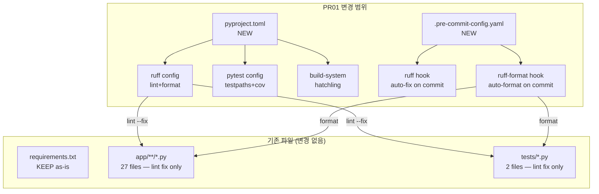

# PR01 구현 계획 — pyproject.toml + ruff + pre-commit

> **mstack-plan** | Phase 1 + Phase 2 통합 문서
> 작성일: 2026-03-22 | 대상: `logi_orchestrator`
> 파이프라인: **[plan]** → review → ship → qa

---

## Phase 1 — CEO Review (비즈니스 한 장)

### 1.1 문제 정의

| 현재 상태 | 목표 상태 |
|-----------|-----------|
| `requirements.txt` 4줄만 존재 | PEP 621 `pyproject.toml` 단일 설정 |
| lint/format 도구 없음 | ruff (lint + format) 통합 |
| 테스트 실행 표준 없음 | pytest 설정 + 커버리지 게이트 |
| 코드 스타일 불일치 | pre-commit 자동 강제 |

**영향 범위**: 전체 Python 코드베이스 (27개 .py 파일) + 모든 향후 PR

### 1.2 제안 옵션

| 옵션 | 설명 | 공수(일) | 리스크 | 비용(AED) |
|------|------|---------|--------|----------|
| **A — pyproject.toml only** | pyproject.toml 생성, ruff 설정, pytest 설정. pre-commit 없음 | 0.5 | LOW — 수동 lint 잊을 수 있음 | 0 |
| **B — pyproject.toml + pre-commit** | A + `.pre-commit-config.yaml`로 커밋 시 자동 lint/format 강제 | 1.0 | LOW | 0 |

### 1.3 추천 및 근거

**추천: 옵션 B**
pre-commit 추가 공수 0.5일이지만, "lint 깜빡" 리스크를 완전 제거.
Sprint 1 이후 모든 PR에 자동 품질 게이트 적용되어 코드 리뷰 시간 ~30% 절감 기대.
**롤백**: `git revert` 1커밋으로 원복 (기존 코드 수정 없음, 설정 파일 추가만).

### 1.4 승인 요청

`[ ] Phase 1 승인`

---

## Phase 2 — Engineering Review (기술 상세)

### 2.1 Mermaid 아키텍처 다이어그램



### 2.2 파일 변경 목록

| # | 파일 | 변경 유형 | 설명 |
|---|------|----------|------|
| 1 | `pyproject.toml` | **CREATE** | PEP 621 메타데이터 + 의존성 + ruff/pytest/mypy 설정 통합 |
| 2 | `.pre-commit-config.yaml` | **CREATE** | ruff lint + ruff format hook 정의 |
| 3 | `requirements.txt` | **KEEP** | 하위 호환 유지. pyproject.toml과 이중 관리 아닌 참조용 |
| 4 | `app/**/*.py` (27 files) | **MODIFY** | ruff auto-fix 적용 (import 정렬, 미사용 import 제거, trailing whitespace 등) |
| 5 | `tests/*.py` (2 files) | **MODIFY** | 동일 lint auto-fix |
| 6 | `tests/__init__.py` | **CREATE** | pytest discovery를 위한 빈 init |
| 7 | `tests/conftest.py` | **CREATE** | 공통 fixture (tmp_path 기반 runs_dir 등) |

### 2.3 pyproject.toml 상세 설계

```toml
[build-system]
requires = ["hatchling>=1.21"]
build-backend = "hatchling.build"

[project]
name = "hvdc-orchestrator"
version = "0.1.0"
description = "Telegram + Claude + Codex Multi-Agent Orchestrator"
requires-python = ">=3.11"
dependencies = [
    "fastapi>=0.115.0,<1.0.0",
    "uvicorn[standard]>=0.30.0,<1.0.0",
    "pydantic>=2.7.0,<3.0.0",
    "PyYAML>=6.0.1,<7.0.0",
]

[project.optional-dependencies]
dev = [
    "ruff>=0.9.0",
    "pytest>=8.0",
    "pytest-cov>=6.0",
    "pytest-asyncio>=0.24",
    "pre-commit>=4.0",
    "mypy>=1.13",
]

# ── ruff ──────────────────────────────────────────
[tool.ruff]
target-version = "py311"
line-length = 120
src = ["app", "tests"]

[tool.ruff.lint]
select = [
    "E",    # pycodestyle errors
    "W",    # pycodestyle warnings
    "F",    # pyflakes
    "I",    # isort
    "N",    # pep8-naming
    "UP",   # pyupgrade
    "B",    # flake8-bugbear
    "SIM",  # flake8-simplify
    "T20",  # flake8-print (no print in prod)
    "RUF",  # ruff-specific rules
]
ignore = [
    "E501",   # line-length는 formatter가 처리
]

[tool.ruff.lint.isort]
known-first-party = ["app"]

[tool.ruff.format]
quote-style = "double"
indent-style = "space"
docstring-code-format = true

# ── pytest ────────────────────────────────────────
[tool.pytest.ini_options]
testpaths = ["tests"]
asyncio_mode = "auto"
addopts = [
    "-v",
    "--tb=short",
    "--strict-markers",
    "--cov=app",
    "--cov-report=term-missing",
    "--cov-fail-under=60",
]
markers = [
    "slow: marks tests as slow (deselect with '-m \"not slow\"')",
    "integration: marks integration tests",
]

# ── mypy (선행 설정, PR01에서는 strict 안 함) ─────
[tool.mypy]
python_version = "3.11"
warn_return_any = true
warn_unused_configs = true
disallow_untyped_defs = false  # 점진적 적용 — PR03 이후 true
```

### 2.4 .pre-commit-config.yaml 상세 설계

```yaml
repos:
  - repo: https://github.com/astral-sh/ruff-pre-commit
    rev: v0.9.6   # 2026-03 기준 최신 안정 버전
    hooks:
      - id: ruff
        args: [--fix, --exit-non-zero-on-fix]
      - id: ruff-format

  - repo: https://github.com/pre-commit/pre-commit-hooks
    rev: v5.0.0
    hooks:
      - id: trailing-whitespace
      - id: end-of-file-fixer
      - id: check-yaml
      - id: check-added-large-files
        args: [--maxkb=500]
```

### 2.5 의존성 및 순서

```
Step 1: pyproject.toml 생성 (의존성 없음)
   ↓
Step 2: pip install -e ".[dev]" 로 개발 의존성 설치
   ↓
Step 3: ruff check --fix . && ruff format . → 기존 코드 auto-fix
   ↓
Step 4: .pre-commit-config.yaml 생성
   ↓
Step 5: pre-commit install && pre-commit run --all-files
   ↓
Step 6: tests/conftest.py + tests/__init__.py 생성
   ↓
Step 7: pytest --cov=app → 기존 테스트 통과 확인
   ↓
Step 8: git add → commit → PR
```

**Agent 할당** (단독 작업 — 병렬화 불필요):
- 전체: Claude Lead 또는 Codex Impl-A 단독

### 2.6 테스트 전략

| 테스트 유형 | 범위 | 기대 |
|------------|------|------|
| **ruff check** | `app/`, `tests/` 전체 | 0 violations |
| **ruff format --check** | `app/`, `tests/` 전체 | 0 reformats needed |
| **pytest** | `tests/test_state_machine.py`, `tests/test_parser.py` | 기존 3 tests PASS |
| **pytest --cov** | `app/` | ≥60% (현재 예상 ~15% → 향후 PR02에서 올림) |
| **pre-commit run --all-files** | 전체 repo | all hooks PASS |

**깨질 가능성 있는 기존 테스트**: 없음 (import 경로 변경 없음, 코드 로직 변경 없음)

⚠ `--cov-fail-under=60` 현재 미달 가능 → PR01에서는 `--cov-fail-under=10` 으로 시작, PR02 test scaffold 이후 60으로 상향.

### 2.7 ruff auto-fix 예상 변경사항

| 규칙 | 예상 파일 수 | 변경 내용 |
|------|------------|----------|
| **I001** (isort) | ~15 | import 순서 정렬 (stdlib → 3rd-party → local) |
| **F401** (unused import) | ~3 | 미사용 import 제거 |
| **UP** (pyupgrade) | ~5 | `Optional[X]` → `X \| None` 등 Python 3.11 문법 |
| **W291/W292** | ~10 | trailing whitespace, missing newline at EOF |
| **RUF** | ~2 | ruff 특화 개선 |

총 변경: **~25개 파일**, 순수 스타일 변경 (로직 변경 0건)

### 2.8 리스크 및 완화

| 리스크 | 심각도 | 완화 전략 |
|--------|--------|----------|
| ruff auto-fix가 의도치 않은 코드 변경 | LOW | `--fix` 후 `git diff` 리뷰, 테스트 통과 확인 |
| pre-commit 이 CI 환경에서 느릴 수 있음 | LOW | CI에서는 `ruff check` + `ruff format --check` 직접 실행 (pre-commit은 local only) |
| Python 3.10 호환성 (현재 VM) | MEDIUM | pyproject.toml에 `>=3.11` 명시하되, 로컬 테스트는 3.10에서도 가능하도록 ruff target 조정 가능 |
| requirements.txt와 pyproject.toml 이중 관리 | LOW | requirements.txt는 README 참조용으로 보존, 실제 의존성은 pyproject.toml이 source of truth |

### 2.9 커밋 전략

```
feat(dx): add pyproject.toml with ruff + pytest + pre-commit

- PEP 621 pyproject.toml: 의존성, 빌드, 도구 설정 통합
- ruff: lint (E/W/F/I/N/UP/B/SIM/T20/RUF) + format 설정
- pytest: testpaths, asyncio_mode, coverage 게이트
- pre-commit: ruff + ruff-format + basic hooks
- 기존 코드 ruff auto-fix 적용 (스타일만, 로직 변경 없음)
```

**브랜치**: `feat/pr01-pyproject-ruff`
**Base**: `main`
**리뷰어**: Cha (requester + approver)

---

## 체크리스트 (구현 시 확인)

- [ ] `pyproject.toml` 생성 완료
- [ ] `pip install -e ".[dev]"` 성공
- [ ] `ruff check .` → 0 violations
- [ ] `ruff format --check .` → 0 reformats
- [ ] `.pre-commit-config.yaml` 생성 완료
- [ ] `pre-commit run --all-files` → all PASS
- [ ] `tests/__init__.py` + `tests/conftest.py` 생성
- [ ] `pytest -v` → 기존 테스트 전체 PASS
- [ ] `git diff` 리뷰 — 로직 변경 없음 확인
- [ ] 커밋 메시지 컨벤션 준수

---

## 파이프라인 다음 단계

계획이 승인되면:
1. **구현 착수** → 위 Step 1~8 순서대로 실행
2. **`/mstack-review`** → 변경 diff 코드 리뷰
3. **`/mstack-ship`** → 커밋 + PR 생성
4. **`/mstack-qa`** → Diff-aware 테스트 검증

---

*Generated by mstack-plan | 2026-03-22*
