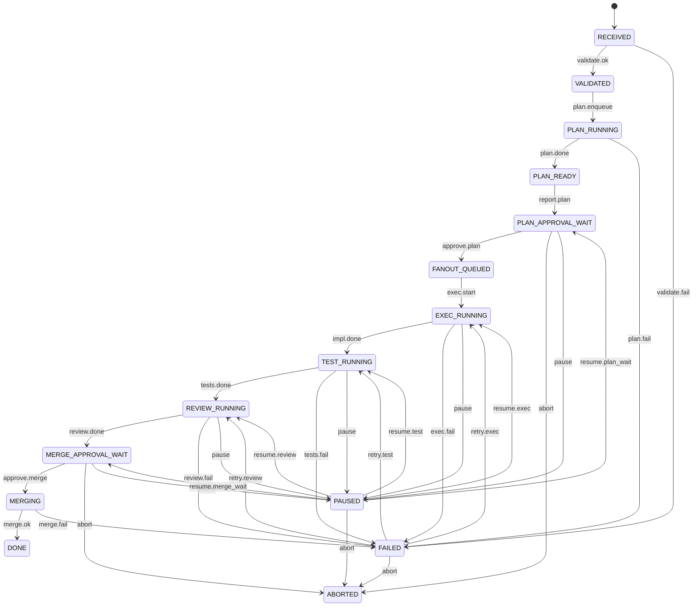

# orchestrator_state_machine.md

## 1. 목적

이 문서는 Job lifecycle 상태와 전이 규칙을 정의한다.

모든 Job은 **명시 상태**를 가져야 하며, 승인 전이와 실패 전이는 audit log에 반드시 기록된다.

## 2. 상태 목록

| State | 의미 |
|---|---|
| RECEIVED | Telegram 명령 수신 완료 |
| VALIDATED | 인자 검증 완료 |
| PLAN_RUNNING | Claude Plan 생성 중 |
| PLAN_READY | Plan 산출물 준비 완료 |
| PLAN_APPROVAL_WAIT | Plan 승인 대기 |
| FANOUT_QUEUED | 실행 task queue 적재 완료 |
| EXEC_RUNNING | Codex 구현 task 실행 중 |
| TEST_RUNNING | lint/test 실행 중 |
| REVIEW_RUNNING | Claude 리뷰 중 |
| MERGE_APPROVAL_WAIT | Merge 승인 대기 |
| MERGING | merge 또는 PR 생성 중 |
| DONE | 완료 |
| FAILED | 실패 |
| PAUSED | 일시 정지 |
| ABORTED | 중단 |

## 3. 상태 전이 다이어그램



## 4. 전이 규칙

### RECEIVED -> VALIDATED

조건:
- 필수 인자 존재
- repo allowlist 통과
- role 허용

실패 시:
- `FAILED`
- reason=`INVALID_ARGUMENT` 또는 `UNAUTHORIZED`

### VALIDATED -> PLAN_RUNNING

조건:
- Job ID 생성 완료
- run path 생성 완료
- audit 파일 생성 완료

### PLAN_RUNNING -> PLAN_READY

조건:
- `PLAN.md`
- `TASKS.yaml`
- `RISKS.md`
- `TESTS.md`

위 4개 산출물이 모두 존재해야 한다.

### PLAN_READY -> PLAN_APPROVAL_WAIT

조건:
- Plan 보고 메시지 전송 성공
- Telegram action command 포함

### PLAN_APPROVAL_WAIT -> FANOUT_QUEUED

이벤트:
- `/approve.plan JOB-XXXX`

검증:
- approver role
- 중복 승인 아님

### FANOUT_QUEUED -> EXEC_RUNNING

조건:
- worktree A 생성
- worktree B 생성
- dispatch task queue 적재 완료

### EXEC_RUNNING -> TEST_RUNNING

조건:
- 구현 task 필수 artifact 생성
- patch/diff 1개 이상 존재

### TEST_RUNNING -> REVIEW_RUNNING

조건:
- `test_results.json` 존재
- exit code 기록 완료

### REVIEW_RUNNING -> MERGE_APPROVAL_WAIT

조건:
- `review_summary.md` 존재
- `merge_verdict.json` 존재
- rollback 포인트 존재

### MERGE_APPROVAL_WAIT -> MERGING

이벤트:
- `/approve.merge JOB-XXXX`

검증:
- approver role
- `review_verdict != FAIL`

### MERGING -> DONE

조건:
- merge 성공 또는 PR 생성 성공
- `final_report.md` 생성
- 상태 archive 완료

## 5. Pause / Resume 규칙

### pause 허용 상태

- PLAN_APPROVAL_WAIT
- EXEC_RUNNING
- TEST_RUNNING
- REVIEW_RUNNING
- MERGE_APPROVAL_WAIT

### resume 허용 상태

- PAUSED 만 가능

### resume 동작

- pause 이전 상태를 `resume_target_state`에 저장
- resume 시 해당 상태로 복귀
- in-flight worker는 재시작 또는 재부착

## 6. 실패 처리 규칙

### 실패 분류

- `VALIDATION_ERROR`
- `PLAN_ERROR`
- `EXEC_ERROR`
- `TEST_ERROR`
- `REVIEW_ERROR`
- `MERGE_ERROR`
- `SYSTEM_ERROR`

### 재시도 규칙

- task 단위 재시도 최대 2회
- 동일 원인 2회 반복 시 human review
- merge 실패는 자동 재시도 금지
- validation 실패는 입력 수정 후 새 job 권장

## 7. 이벤트 목록

| Event | 설명 |
|---|---|
| validate.ok | 입력 검증 성공 |
| validate.fail | 입력 검증 실패 |
| plan.enqueue | Plan worker 할당 |
| plan.done | Plan 산출물 완료 |
| plan.fail | Plan 실패 |
| approve.plan | Plan 승인 |
| exec.start | 구현 fan-out 시작 |
| impl.done | 구현 완료 |
| exec.fail | 구현 실패 |
| tests.done | 테스트 완료 |
| tests.fail | 테스트 실패 |
| review.done | 리뷰 완료 |
| review.fail | 리뷰 실패 |
| approve.merge | Merge 승인 |
| merge.ok | merge 성공 |
| merge.fail | merge 실패 |
| pause | 일시정지 |
| resume.* | 상태별 재개 |
| abort | 중단 |

## 8. 상태 저장 예시

```json
{
  "job_id": "JOB-0001",
  "state": "PLAN_APPROVAL_WAIT",
  "previous_state": "PLAN_READY",
  "resume_target_state": null,
  "phase": "approval_plan",
  "retry_count": {
    "T040": 1
  },
  "requested_by": "@mrcha",
  "approved_by": null,
  "updated_at": "2026-03-22T10:20:00+04:00"
}
```

## 9. Audit 이벤트 예시

```json
{
  "ts": "2026-03-22T10:20:05+04:00",
  "job_id": "JOB-0001",
  "from": "PLAN_READY",
  "to": "PLAN_APPROVAL_WAIT",
  "event": "report.plan",
  "actor": "SYSTEM",
  "trace_id": "tg-20260322-0001"
}
```

## 10. 최소 구현 규칙

- 상태 변경은 항상 DB transaction 안에서 수행
- 상태 변경 후 audit append 필수
- worker ack 전에 상태를 먼저 기록
- Telegram 전송 실패는 재시도 queue로 분리
- `DONE`, `ABORTED`는 terminal state
- terminal state 진입 후 write task 금지

## 11. 권장 상태 enum

```python
from enum import Enum

class JobState(str, Enum):
    RECEIVED = "RECEIVED"
    VALIDATED = "VALIDATED"
    PLAN_RUNNING = "PLAN_RUNNING"
    PLAN_READY = "PLAN_READY"
    PLAN_APPROVAL_WAIT = "PLAN_APPROVAL_WAIT"
    FANOUT_QUEUED = "FANOUT_QUEUED"
    EXEC_RUNNING = "EXEC_RUNNING"
    TEST_RUNNING = "TEST_RUNNING"
    REVIEW_RUNNING = "REVIEW_RUNNING"
    MERGE_APPROVAL_WAIT = "MERGE_APPROVAL_WAIT"
    MERGING = "MERGING"
    DONE = "DONE"
    FAILED = "FAILED"
    PAUSED = "PAUSED"
    ABORTED = "ABORTED"
```
